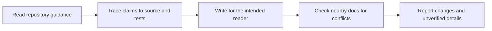

# Docs from Code

> Accurate developer documentation grounded in current source code.

## Install in Codex

Add this repository as a plugin marketplace, then install the plugin:

```powershell
codex plugin marketplace add GhosTnever-lkm/docs-from-code
codex plugin add docs-from-code --marketplace docs-from-code
```

Run `codex plugin list` to confirm it is installed. Codex may ask you to restart or reload plugins before the skill becomes available.

## Use it

Start a Codex task that matches the skill's purpose. The plugin instructions live in `skills/docs-from-code/SKILL.md` and are included in the source for inspection.

## Scope

This is a focused Codex skill. It has no external service, background process, or credential requirement. See the skill file for its workflow and limits.

## Workflow



## ☕ Support / Pro Version

Docs from Code is free and open source. There is no paid Pro edition at this time. You can support GhosTnever on [Boosty](https://boosty.to/azizazimov) or [Buy Me a Coffee](https://www.buymeacoffee.com/azizazimov8).

<details>
<summary>Public cryptocurrency addresses</summary>

Send only the named asset on its matching network.

| Network | Address |
|---|---|
| Bitcoin | `bc1qn75pj4n7gyl2k5kf2f97elvyenz52q6nn2g30u` |
| TRON | `TCBSy38X57hA6w2onJcxom24x1febc1mP1` |
| BNB Smart Chain | `0xD431a917961E0b086B96D9F72b5C8fF19b19068a` |

</details>

## License

MIT. See [LICENSE](LICENSE).

Current version: 1.0.0. See [CHANGELOG.md](CHANGELOG.md).
